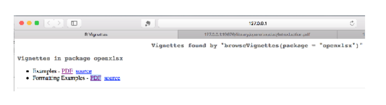

## Disclaimer
This document describes how a dataframe is transfered into an Excel workbook and how some special formatting is applied to the newly created spreadsheet all using R-package `openxlsx`.

## Background
It is a fact that most statistics and data analysis is done in MS-Excel. Therefore comes the need to transfer data from different systems such as R into Excel workbooks. 

## Preparing steps
The first step before we can start with the data transfer is the installation of the R-package `openxlsx`. This installation can be done using the standard installation infrastructure in R. 

```{r InstallOpenxlsx, eval=FALSE}
install.packages(pkgs = "openxlsx")
```

After installing the package, it is always good to have a look at the documentation. This can be done using the command

```{r BrowseVignettes, eval=FALSE}
browseVignettes(package = "openxlsx")
```

The above command will open a browser window showing links to two different documents. 



The first link points to a vignette showing some examples of how data can be transfered from R to Excel. In what follows, we try to use some of those examples which seam to be relevant for what we try to do. 

## Examples
The simplest way of writing data from R to Excel is by using the function `write.xlsx()`. This function accepts two arguments, the first being the name of a dataframe and the second is the name of the Excel file which is going to be created. Hence writing Andersens iris data to an Excel workbook can be done as follows

```{r WriteIrisToXlsx}
library(openxlsx)
write.xlsx(iris, file = "writeIrisToXLSX1.xlsx")
```

The next step is to define a style for the column headers. The styles are defined and saved in an object `hs`. This object is then passed to function `write.xlsx()`. 

```{r HeaderStyle}
hs <- createStyle(fontColour = "#ffffff", fgFill = "red",
                  halign = "center", valign = "center", textDecoration = "Bold",
                  border = "TopBottomLeftRight", textRotation = 90)
write.xlsx(iris, file = "writeXLSX4.xlsx", borders = "rows", headerStyle = hs)
```

From section "1 Formatting with writeData and writeDataTable"

```{r FormattingWriteDataWriteDataTable}
## data.frame to write
df <- data.frame("Date"       = Sys.Date()-0:4,
                 "Logical"    = c(TRUE, FALSE, TRUE, TRUE, FALSE),
                 "Currency"   = paste("$",-2:2),
                 "Accounting" = -2:2,
                 "hLink"      = "http://cran.r-project.org/",
                 "Percentage" = seq(-1, 1, length.out=5),
                 "TinyNumber" = runif(5) / 1E9, stringsAsFactors = FALSE)
class(df$Currency) <- "currency"
class(df$Accounting) <- "accounting"
class(df$hLink) <- "hyperlink"
class(df$Percentage) <- "percentage"
class(df$TinyNumber) <- "scientific"
## Formatting can be applied simply through the write functions
## global options can be set to further simplify things
options("openxlsx.borderStyle" = "thin")
options("openxlsx.borderColour" = "#4F81BD")
## create a workbook and add a worksheet
wb <- createWorkbook()
addWorksheet(wb, "writeData auto-formatting")
writeData(wb, 1, df, startRow = 2, startCol = 2)
writeData(wb, 1, df, startRow = 9, startCol = 2, borders = "surrounding")
writeData(wb, 1, df, startRow = 16, startCol = 2, borders = "rows")
writeData(wb, 1, df, startRow = 23, startCol = 2, borders ="columns")
writeData(wb, 1, df, startRow = 30, startCol = 2, borders ="all")
## headerStyles
hs1 <- createStyle(fgFill = "#4F81BD", halign = "CENTER", textDecoration = "Bold",
border = "Bottom", fontColour = "white")
writeData(wb, 1, df, startRow = 16, startCol = 10, headerStyle = hs1,
borders = "rows", borderStyle = "medium")
## to change the display text for a hyperlink column just write over those cells
writeData(wb, sheet = 1, x = paste("Hyperlink", 1:5), startRow = 17, startCol = 14)
1
## writing as an Excel Table
addWorksheet(wb, "writeDataTable")
writeDataTable(wb, 2, df, startRow = 2, startCol = 2)
writeDataTable(wb, 2, df, startRow = 9, startCol = 2, tableStyle = "TableStyleLight9")
writeDataTable(wb, 2, df, startRow = 16, startCol = 2, tableStyle = "TableStyleLight2")
writeDataTable(wb, 2, df, startRow = 23, startCol = 2, tableStyle = "TableStyleMedium21")
# openXL(wb)
```

## Create our own style
Based on the above examples, we can combine some of the features to create our own style

```{r OurOwnStyle}
wb <- createWorkbook()
addWorksheet(wb, "IrisOurOwnStyle")
writeDataTable(wb, 1, iris, startRow = 2, startCol = 2, 
               tableStyle = "TableStyleMedium17", 
               headerStyle = createStyle(textRotation = 90))

# openXL(wb)
```

With a larger test-data set

```{r LargTestData}
devtools::load_all()
dfZw <- read.csv2(file = system.file(file.path("inst","extdata","testdata","csv","NewOrder.csv"), 
                                     package = "RZwToExcel"))
wb <- createWorkbook()
addWorksheet(wb, "Zuchtwerte")
writeDataTable(wb, 1, dfZw, startRow = 1, startCol = 1, 
               tableStyle = "TableStyleMedium17", 
               headerStyle = createStyle(textRotation = 90))
saveWorkbook(wb, "ZwVMS.xlsx", overwrite = TRUE)
```


